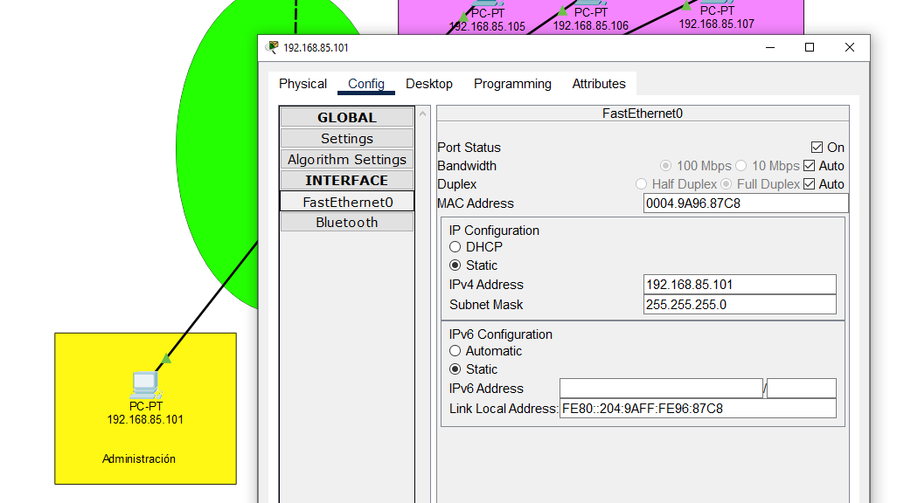

# Manual técnico

---

#### Diego Andrés Huite Alvarez

---

### Topología de red:

### Configuración de computadores

- **Área administración (nivel 1)**
  
  

- **Área gerencia (nivel 1)**
  
  

- **Área atención al cliente (nivel 1)**
  
  

- **Área recursos humanos (nivel 1)**
  
  

- **Área oficina A (nivel 2)**
  
  

- **Área oficina B (nivel 2)**
  
  

- **Área oficina C (nivel 2)**
  
  

---

### Ping entre hosts

- **Ping administración a oficina B**
  
  

- **Ping gerencia a oficina A**
  
  

- **Ping recursos humanos a oficina C**
  
  

---

### Demostración de la captura de un paquete ARP/ICMP

