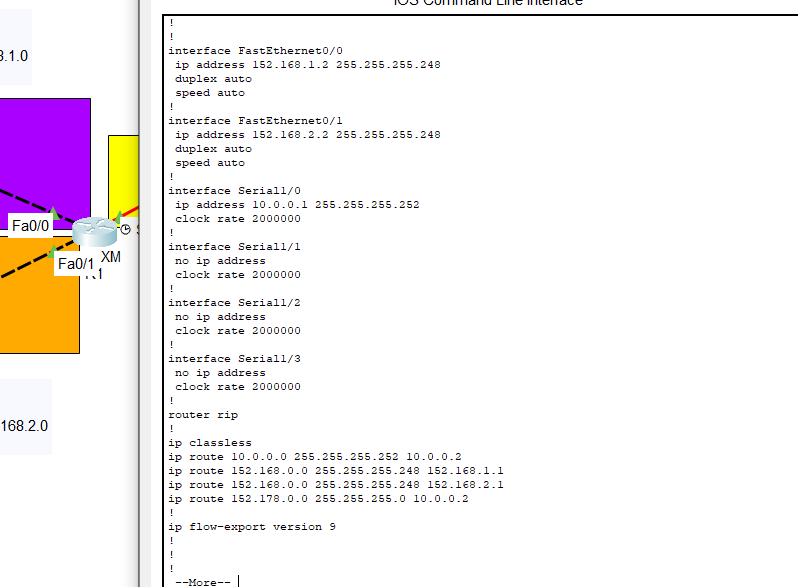
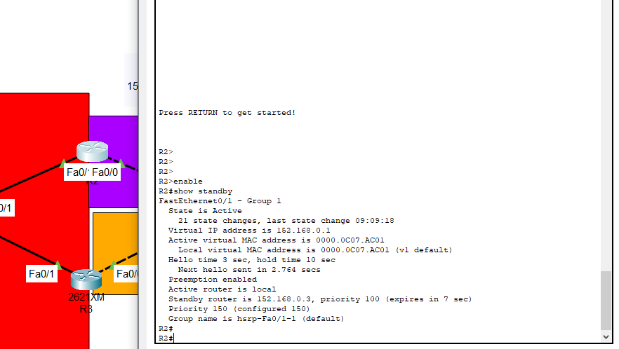
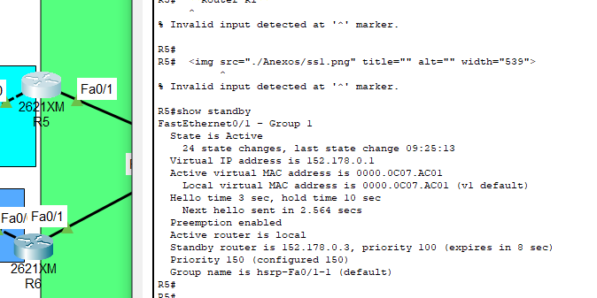

# Manual técnico

---

#### Diego Andrés Huite Alvarez

---

### Configuraciones de routers y switch:

### Configuración routers

- **Router R1**
  
  

- **Router R2**
  
  

- **Router R5**
  
  
  
  --- 
  
  ### Comandos utilizados

- Creación de ruta estática
  
  ```shell
  ip route <ip_red> <mascara_de_subred> <puerta_de_enlace_del_hsrp> 
  ```

- Creación de Port channel LACP
  
  ```shell
  # switch activo
  enable
  configure terminal
  interface range ethernet fa0/3 - fa0/4
  channel-group 1 mode active
  interface port-channel 1
  switchport mode trunk  
  end
  
  # switch pasivo
  enable
  configure terminal
  interface range ethernet fa0/3 - fa0/4
  channel-group 1 mode active
  end
  ```

- Creación de Port channel PAGP
  
  ```shell
  # switch activo
  enable
  configure terminal
  interface range ethernet fa0/3 - fa0/4
  channel-group 2 mode desirable
  exit
  interface port-channel 2
  switchport mode trunk
  end
  
  # switch pasivo
  
  enable
  configure terminal
  interface range ethernet fa0/3 - fa0/4
  channel-group 2 mode auto
  exit
  ```

- Comandos para verificar el correcto funcionamiento
  
  ```shell
  ping 152.178.0.4
  ```

- Salida
  
  ```shell
  Pinging 152.178.0.4 with 32 bytes of data:
  
  Reply from 152.178.0.4: bytes=32 time<1ms TTL=124
  Reply from 152.178.0.4: bytes=32 time=1ms TTL=124
  Reply from 152.178.0.4: bytes=32 time=1ms TTL=124
  Reply from 152.178.0.4: bytes=32 time=1ms TTL=124
  
  Ping statistics for 152.178.0.4:
      Packets: Sent = 4, Received = 4, Lost = 0 (0% loss),
  Approximate round trip times in milli-seconds:
      Minimum = 0ms, Maximum = 1ms, Average = 0ms
  ```
