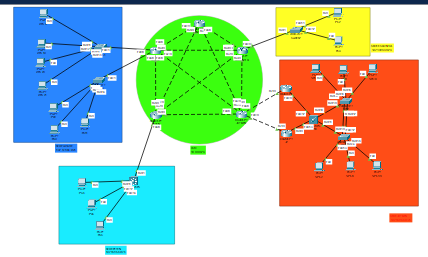
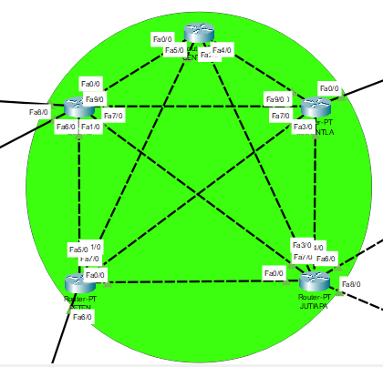
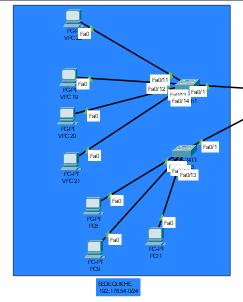
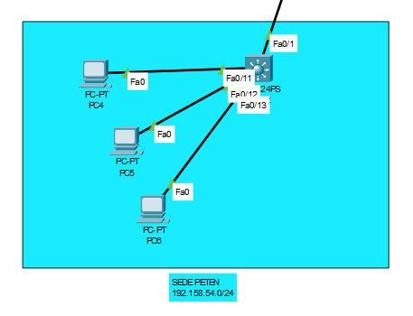
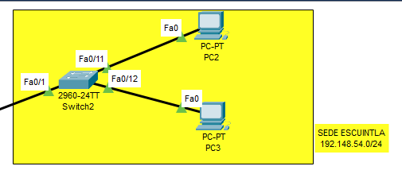

# Manual técnico

---

#### Diego Andres Huite Alvarez - 202003585

#### Dayana Alejandra Reyes Rodríguez - 202002364

---

# VLAN

## Sede Jutiapa

| VLAN         | ID VLAN | EQUIPOS | MASCARA         | WILDCARD | ID RED        | PRIMERA IP    | ULTIMA IP     | IP BROADCAST  |
| ------------ | ------- | ------- | --------------- | -------- | ------------- | ------------- | ------------- | ------------- |
| VENTAS       | 354     | 25      | 255.255.255.224 | 0.0.0.31 | 192.168.54.0  | 192.168.54.1  | 192.168.54.30 | 192.168.54.31 |
| INFORMATICA  | 454     | 12      | 255.255.255.240 | 0.0.0.15 | 192.168.54.32 | 192.168.54.33 | 192.168.54.46 | 192.168.54.47 |
| RRHH         | 154     | 10      | 255.255.255.240 | 0.0.0.15 | 192.168.54.48 | 192.168.54.49 | 192.168.54.62 | 192.168.54.63 |
| CONTABILIDAD | 254     | 4       | 255.255.255.248 | 0.0.0.7  | 192.168.54.64 | 192.168.54.65 | 192.168.54.70 | 192.168.54.71 |

## Sede Escuintla

| VLAN   | ID VLAN | EQUIPOS | MASCARA         | WILDCARD | ID RED        | PRIMERA IP    | ULTIMA IP     | IP BROADCAST  |
| ------ | ------- | ------- | --------------- | -------- | ------------- | ------------- | ------------- | ------------- |
| VENTAS | 354     | 20      | 255.255.255.224 | 0.0.0.31 | 192.148.54.0  | 192.148.54.1  | 192.148.54.30 | 192.148.54.31 |
| RRHH   | 154     | 5       | 255.255.255.248 | 0.0.0.7  | 192.148.54.32 | 192.148.54.33 | 192.148.54.38 | 192.148.54.39 |

## Sede Quiche

| VLAN         | ID VLAN | EQUIPOS | MASCARA         | WILDCARD | ID RED         | PRIMERA IP     | ULTIMA IP      | IP BROADCAST   |
| ------------ | ------- | ------- | --------------- | -------- | -------------- | -------------- | -------------- | -------------- |
| VENTAS       | 354     | 36      | 255.255.255.192 | 0.0.0.63 | 192.178.54.0   | 192.178.54.1   | 192.178.54.62  | 192.178.54.63  |
| INFORMATICA  | 454     | 21      | 255.255.255.224 | 0.0.0.31 | 192.178.54.64  | 192.178.54.65  | 192.178.54.94  | 192.178.54.95  |
| RRHH         | 154     | 12      | 255.255.255.240 | 0.0.0.15 | 192.178.54.96  | 192.178.54.97  | 192.178.54.110 | 192.178.54.111 |
| CONTABILIDAD | 254     | 10      | 255.255.255.240 | 0.0.0.7  | 192.178.54.112 | 192.178.54.113 | 192.178.54.126 | 192.178.54.127 |

## Sede Peten

| VLAN        | ID VLAN | EQUIPOS | MASCARA         | WILDCARD | ID RED        | PRIMERA IP    | ULTIMA IP     | IP BROADCAST  |
| ----------- | ------- | ------- | --------------- | -------- | ------------- | ------------- | ------------- | ------------- |
| VENTAS      | 354     | 30      | 255.255.255.224 | 0.0.0.31 | 192.158.54.0  | 192.158.54.1  | 192.158.54.30 | 192.158.54.31 |
| INFORMATICA | 454     | 15      | 255.255.255.224 | 0.0.0.31 | 192.158.54.32 | 192.158.54.33 | 192.158.54.62 | 192.158.54.63 |
| RRHH        | 154     | 10      | 255.255.255.240 | 0.0.0.15 | 192.158.54.64 | 192.158.54.65 | 192.158.54.78 | 192.158.54.79 |

# IPS

## Sede Jutiapa

| VLAN         | PC    | IP            |
| ------------ | ----- | ------------- |
| VENTAS       | VPC14 | 192.168.54.2  |
| VENTAS       | VPC8  | 192.168.54.3  |
| INFORMATICA  | VPC6  | 192.168.54.34 |
| INFORMATICA  | VPC7  | 192.168.54.35 |
| RRHH         | VPC5  | 192.168.54.50 |
| CONTABILIDAD | VPC15 | 192.168.54.66 |

## Sede Escuintla

| VLAN   | PC  | IP            |
| ------ | --- | ------------- |
| VENTAS | PC2 | 192.148.54.2  |
| RRHH   | PC3 | 192.148.54.34 |

## Sede Quiche

| VLAN         | PC    | IP             |
| ------------ | ----- | -------------- |
| VENTAS       | VPC22 | 192.178.54.2   |
| VENTAS       | VPC19 | 192.178.54.3   |
| VENTAS       | VPC20 | 192.178.54.4   |
| INFORMATICA  | VPC21 | 192.178.54.66  |
| INFORMATICA  | PC8   | 192.178.45.67  |
| RRHH         | PC9   | 192.178.45.98  |
| CONTABILIDAD | PC11  | 192.178.45.114 |

## Sede Peten

| VLAN        | PC  | IP            |
| ----------- | --- | ------------- |
| VENTAS      | PC4 | 192.158.54.2  |
| INFORMATICA | PC5 | 192.158.54.34 |
| RRHH        | PC6 | 192.158.54.66 |

# Topologia

## Topologia completa



## Core



## Quiche



## Peten



## Jutiapa


## Escuintla



# Comandos utilizados

## subinterfaces

```console
 enable
 configure terminal
 encapsulation dot1Q 354
 ip adress <ip> <nmask>
```

## EIGRP

```console
 enable
 configure terminal
 router eigrp 10
 network 10.0.0.0
 network <ip de la network>
```

## OSPF

```console
enable
configure terminal
router ospf 10
network <direccion-red> area 0
```

## RIP

```console
enable
configure terminal
router rip
network <direccion-de-red>
```